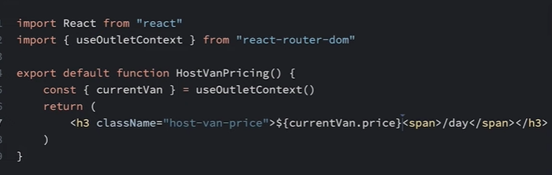
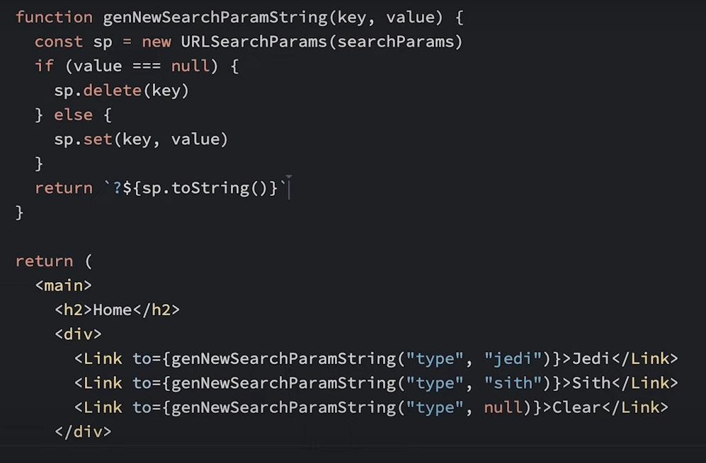
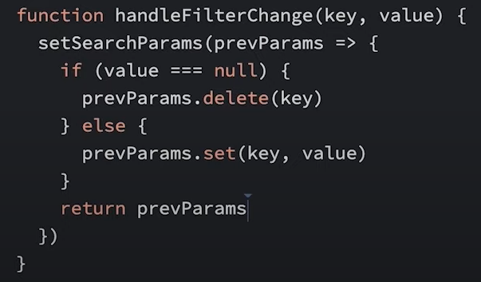
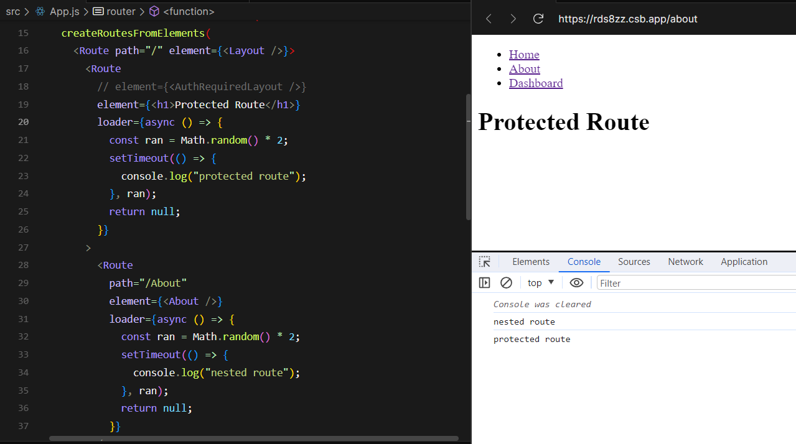
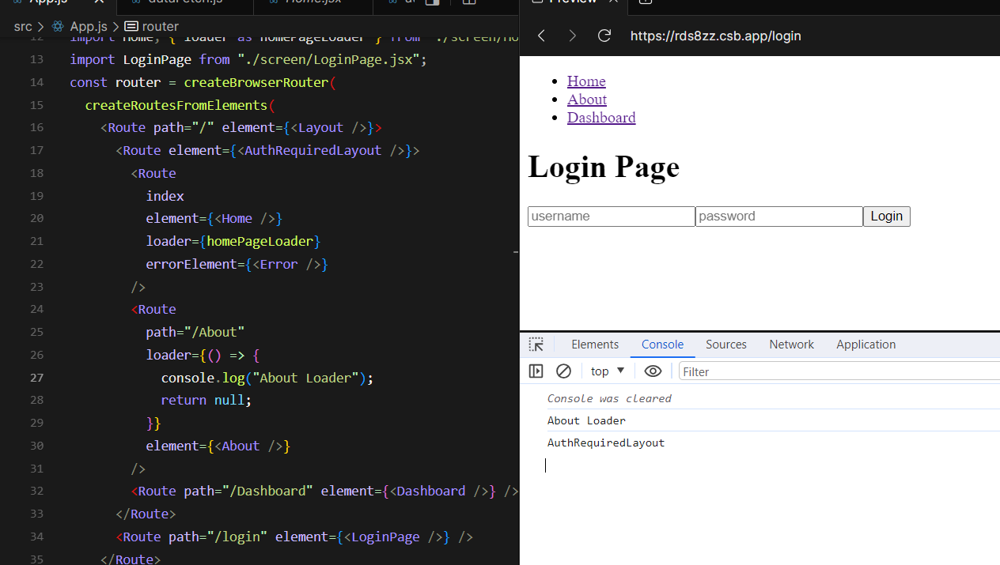
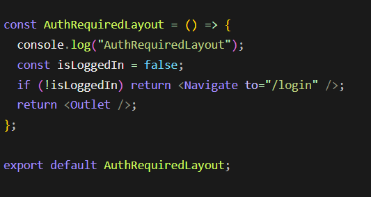
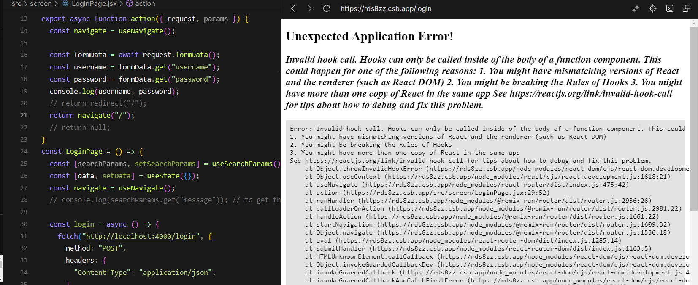

# React-Router-Dom

<p align="center">

</p>

<p align="center">Easiest and Most Detailed Way to understand React Router Dom.</p>
<p align="center" style="margin-bottom: 10px;">This Doc was prepared taking inspiration from Bob Ziroll, Scrimba’s Head of Education, to provide a quick guide to developers who have less time to go through the course again but I do recommend checking out the <a href="https://www.youtube.com/watch?v=nDGA3km5He4">Video</a></p>

&nbsp;
&nbsp;
&nbsp;
&nbsp;
&nbsp;

| Module Name                                                                                                   | Description                                                                                                                |
| ------------------------------------------------------------------------------------------------------------- | -------------------------------------------------------------------------------------------------------------------------- |
| [Installation](#Installation)                                                                                 | Helps you install the react router package                                                                                 |
| [Setup in React Project](#Setup-in-React-Project)                                                             | Helps you setup the react router dom.                                                                                      |
| [Element VS Component](#Difference-between-Element-and-Component)                                             | Understand difference between Element and Component                                                                        |
| [Conditional Rendering in same url](#Conditional-Rendering-in-same-url)                                       | Helps you conditional render the element.                                                                                  |
| [Redirection Conditionally](#Redirection-Conditionally)                                                       | Help you to redirect user some where went conditons are not met.                                                           |
| [Link](#Link)                                                                                                 | Optimised Version of a href tag                                                                                            |
| [Router Params](#Router-Params)                                                                               | helps you get the data from the url parameter                                                                              |
| [Nested Routes](#Nested-Routes)                                                                               | Use this when you want to share the common Ui between the same routes.                                                     |
| [Layout Route](#Layout-Route)                                                                                 | Used in senarios where you want the certain component through out the Routes something like NavBar or Footer.              |
| [Outlet](#Outlet)                                                                                             | This will take the child route under the parent route and render on the screen when url matches.                           |
| [Deep Nested Route](#Deep-Nested-Route)                                                                       | Techniques to be used when you have deep nested routes.                                                                    |
| [Relative Routes](#Relative-Routes)                                                                           | You donot need actually need to have that / at each level of path.                                                         |
| [Index](#Index)                                                                                               | Used when you want to render child component with parent layouts as default.                                               |
| [NavLink](#NavLink)                                                                                           | Used for visual feedback the you opted for the path.                                                                       |
| [End](#End)                                                                                                   | To restrict the Active route style.                                                                                        |
| [Relative Links](#Relative-Links)                                                                             | Same as Relative Routes but for NavLink/ Link.                                                                             |
| [Current Route ( . )](#Current-Route--)                                                                       | suggested to use this approach for NavLink to be used for the indexed child route under the parent which shares same URL's |
| [Relative Path](#Relative-Path)                                                                               | This is used for the going back one level backward the path. from /vans/:id to /vans                                       |
| [Outlet Context](#Outlet-Context)                                                                             | when you want pass data from the Parent route to child Routes.                                                             |
| [useOutletContext](#useOutletContext)                                                                         | Use this in child route component to get the data that is passed in the parent route context.                              |
| [Search / Query Parameters](#Search---Query-Parameters)                                                       | use this when you wnat to extract data from the query parameter or set data in query parameters.                           |
| [URLSearchParams (Not Related to React Router)](#URLSearchParams-Not-Related-to-React-Router)                 | Native way of extracti ng data form Url.                                                                                   |
| [useSearchParams()](#useSearchParams)                                                                         | implementation of useSearchParams.                                                                                         |
| [Link State](#LinkState)                                                                                      | Mechanism to send state data to next page and use it when to try to route to back page. can be used in filters.            |
| [useLocation](#useLocation)                                                                                   | hook to get the state data that was passed                                                                                 |
| [404 Error Page](#404-Error-Page)                                                                             | use this when user tries to access the page that is not present.                                                           |
| [Data Layer API](#Data-Layer-API)                                                                             | Build optimised React App                                                                                                  |
| [Loaders](#Loaders)                                                                                           | function that runs before routing happens                                                                                  |
| [Setup](#SETUP)                                                                                               | Implementation details                                                                                                     |
| [Transition from BrowserRouter to createBrowserRouter](#Transition-from-BrowserRouter-to-createBrowserRouter) | 1st way of Implementation                                                                                                  |
| [Another way to transition](#Another-way-to-transition)                                                       | 2nd way of Implementation                                                                                                  |
| [Using Loaders](#Using-Loaders)                                                                               | Implementation of Loaders                                                                                                  |
| [useLoaderData](#useLoaderData)                                                                               | use this to get the data returned by the loader.                                                                           |
| [Loaders Params Feature](#Loaders-Params-Feature)                                                             | Passing Params to loader function.                                                                                         |
| [Handling Errors](#Handling-Errors)                                                                           | Helps you handle the error                                                                                                 |
| [Error while fetch happened](#Error-while-fetch-happened)                                                     | things to do while doing async operation like throwing error                                                               |
| [errorElement](#errorElement)                                                                                 | Define element to show message to the user                                                                                 |
| [useRouterError](#useRouterError)                                                                             | To get the error message in the error element.                                                                             |
| [Protected Routes](#Protected-Routes)                                                                         | Pattern to protect the routes                                                                                              |
| [Setup](#Setup-1)                                                                                             | Implementation Details                                                                                                     |
| [Navigate](#Navigate)                                                                                         | Component that is used to naviagte to another page                                                                         |
| [Parallel Loader Concept](#Parallel-Loader-Concept)                                                           | Discussion about Parallel Loader Concept.                                                                                  |
| [Solution for Parallel Loaders](#Solution-for-Parallel-Loaders)                                               | Solution for parallel loading                                                                                              |
| [Show Message After Redirection](#Show-Message-After-Redirection)                                             | Show message to user after quite redirection could be used at login page.                                                  |
| [New Form and redirect Vs useNavigate](#New-Form)                                                             | Discussion about New form and redirect vs useNavigate                                                                      |
| [Form Component](#Form-Component)                                                                             | Implementation of Form Component                                                                                           |
| [Action Setup](#Action-Setup)                                                                                 | Implementation of Action                                                                                                   |
| [useActionData](#useActionData)                                                                               | Get data that is returned from the Action Function                                                                         |
| [useNavigation](#useNavigation)                                                                               | Show status of async operation like idle,running status.                                                                   |
| [Know Path](#Know-Path)                                                                                       | when you need to know where exactly user wanted to visit before redirecting him to the login page.                         |
| [Deferring Data](#Deferring-Data)                                                                             | Enhanse the ux while make apis call's for                                                                                  |
| [Promises and defer()](#Promises-and-defer)                                                                   | Mechnaisms used                                                                                                            |
| [Await](#Await)                                                                                               | warp the elements that need data after async behaviour is completed                                                        |
| [Suspense](#Suspense)                                                                                         | React Hook to show fallback ui till the await components get rendered.                                                     |
| [Refresh Data using loaders](#Refresh-Data-using-loaders)                                                     | Help to refresh data again from the loader even after the entire page has been loaded.                                     |

### Installation

```
npm install react-router-dom
```

### Setup in React Project

- Wrap the App with the browser Router has shown below.

```
ReactDOM.createRoot(document.getElementById("root")).render(
  <React.StrictMode>
    <BrowserRouter>
      <App />
    </BrowserRouter>
  </React.StrictMode>
);

```

- return like this App.js

```
return (
    <Routes>
      <Route path="/login" Component={LoginPage}></Route>
      <Route path="/" Component={Home}></Route>
    </Routes>
  );

```

### Difference between Element and Component

- Element

```
<Route path="/login" element={<LoginPage></LoginPage>}></Route>
```

- Component

```
<Route path="/" Component={Home}></Route>
```

### Conditional Rendering in same url

- Element to render JSX

```
<Route path="/login" element={loggedInStatus?<LoginPage></LoginPage>:"Hello"}></Route>
```

- Component- Should only provide/render component neither JSX nor <></>

```
<Route path="/login" Component={loggedInStatus?LoginPage:Home}></Route>
```

### Redirection conditionally

```
function App() {
  return (
    <Routes>
      <Route path="/login" element={<LoginPage />} />
      <Route path="/" element={<PrivateRoute component={Home} />} />
    </Routes>
  );
}
```

#### PrivateRoute Implementation

```
const PrivateRoute = ({ component: Component, ...rest }) => {
  const [isAuthenticated, setIsAuthenticated] = useState(null);

  useEffect(() => {
    const fetchData = async () => {
      // Do some condition check
      setIsAuthenticated(.....);
    };

    fetchData();
  }, []);

  if (isAuthenticated === null) {
    // You can optionally render a loading spinner or message while waiting for authentication check
    return <div>Loading...</div>;
  }

  return isAuthenticated ? <Component {...rest} /> : <Navigate to="/login" />;
};

export default PrivateRoute;
```

### Link

- Similar To anchor Tag but it will not refresh the page
- Use this to navigate through URL without page Refresh.

```
<Link to="/home"> <li>Home</li> </Link>
```

### Router Params

```
<Route path="/vans/:id/:type" element={<VansDetailedPage/>}></Route>
```

To Access the Id in the VanDetailedPage component:

```
import {useParams} from 'react-router-dom';

// inside component
const params= useParams();
console.log(params.id) /// will give you the id
console.log(params.type) /// will give you the type
```

### Nested Routes

- Nested Urls:

  - /vans
  - /vans/types

- Shared Ui:
  - When you want to share the common Ui between the same routes.

#### Layout Route

- Used in senarios where you want the certain component through out the Routes something like NavBar or Footer.

- Create a NavBar.jsx file and have your NavBar code there and also create a Layout.jsx file.
- Wrap the all the Routes with Single Parent Route to create a parent child relationship.

```
<Route element={<Layout/>}>
<Route path="/" element={<Home/>}></Route>
<Route path="/vans" element={<Vans/>}></Route>
<Route path="/about" element={<About/>}></Route>
</Route>
```

#### Outlet

- Similar to prop.children for Routes

- This will take the child route under the parent route and render on the screen when url matches.

```
import {Outlet} from 'react-router-dom'

export const Layout=()=>{
  return(
    <div>
      <NavBar/>
      <Outlet/>
    </div>
  )
}
```

#### Deep Nested Route


- Something like above.

```
<Route element={<Layout/>}>
<Route path="/" element={<Home/>}></Route>
<Route path="/vans" element={<Vans/>}></Route>
<Route path="/about" element={<About/>}></Route>

<Route path="/host" element={<HostLayout/>}>

    <Route path="/host" element={<Dashboard/>}></Route> (donot use this,use Index Route to Fix)
    <Route path="/host/income" element={<Income/>}></Route>
    <Route path="/reviews" element={<Reviews/>}></Route>

</Route>
</Route>
```

#### Relative Routes

- You donot need actually need to have that / at each level of path.
- Here if you remove the / for the path it would look for the parent Route if it exist if not it would consider it as the root path.

```
<Route element={<Layout/>}>
        <Route path="/" element={<Home/>}></Route>
        <Route path="vans" element={<Vans/>}></Route>
        <Route path="about" element={<About/>}></Route>

        <Route path="host" element={<HostLayout/>}>
            <Route path="host" element={<Dashboard/>}></Route> (donot use this,use Index Route to Fix)
            <Route path="income" element={<Income/>}></Route>
            <Route path="reviews" element={<Reviews/>}></Route>
         </Route>
</Route>
```

#### Index

- putting index will say that it should also be loaded with the root level path intial

```
<Route path="/" element={<Layout/>}>
      <Route index element={<Home/>}></Route>
      <Route path="vans" element={<Vans/>}></Route>
      <Route path="about" element={<About/>}></Route>

      <Route path="host" element={<HostLayout/>}>
              <Route index element={<Dashboard/>}></Route>
              <Route path="income" element={<Income/>}></Route>
              <Route path="reviews" element={<Reviews/>}></Route>
      </Route>
</Route>
```

### NavLink

- Used for visual feedback the you opted for the path.
- Similar to Link but with extra features.


```
import {NavLink} from 'react-router-dom';

<NavLink to='/' className={({isActive})=>isActive?"activeLinkCSS":notActiveCSS}>Home</NavLink>
<NavLink to='/about'>About</NavLink>
<NavLink to='/contact'>Contact</NavLink>
```

OR

```
const activeStyle={
  fontWeight:"bold",
  textDecoration:"underline",
  color:red;
}

<NavLink to='/' style={({isActive})=>isActive?"activeStyle":null}>Home</NavLink>

```

#### End

- let say you have route something like this when you apply navLink isActive property it will apply style for Dashboard and income if url as income. this is because of the common path.

```
<Route path="host" element={<HostLayout/>}>
              <Route index element={<Dashboard/>}></Route>
              <Route path="income" element={<Income/>}></Route>
              <Route path="reviews" element={<Reviews/>}></Route>
      </Route>
```

- To stop this apply this to your Navlink indexed route.

```
<NavLink end to='/host' style={({isActive})=>isActive?"activeStyle":null}>Home</NavLink>
```

### Relative Links

- when you have routes something like this.

```
<Route path="/" element={<Layout/>}>
      <Route index element={<Home/>}></Route>
      <Route path="vans" element={<Vans/>}></Route>
      <Route path="about" element={<About/>}></Route>

      <Route path="host" element={<HostLayout/>}>
              <Route index element={<Dashboard/>}></Route>
              <Route path="income" element={<Income/>}></Route>
              <Route path="reviews" element={<Reviews/>}></Route>
      </Route>
</Route>
```

- in the navlinks Area you donot need to do like this.

```
<NavLink to='/host' className={({isActive})=>isActive?"activeLinkCSS":notActiveCSS}>Home</NavLink>
<NavLink to='/host/income'>About</NavLink>
<NavLink to='/host/about'>Contact</NavLink>
```

INTO

```
<NavLink to='/host' className={({isActive})=>isActive?"activeLinkCSS":notActiveCSS}>Home</NavLink>
<NavLink to='income'>About</NavLink>
<NavLink to='about'>Contact</NavLink>

```

- this working becoz if you see.

```
<Route path="host" element={<HostLayout/>}></Route>
```

- is the parent of all the path so react router will consider this as path before each child path.

#### Current Route ( . )

- It is suggested to use this approach for the indexed child route under the parent which shares same URL's.

FROM THIS

```
<NavLink to='/host' className={({isActive})=>isActive?"activeLinkCSS":notActiveCSS}>Home</NavLink>
```

TO THIS

```
<NavLink to='.' className={({isActive})=>isActive?"activeLinkCSS":notActiveCSS}>Home</NavLink>
```

### Relative Path

- This is used for the going back one level backward the path.

- imagine you have route something like this.

```
<Route path="host" element={<HostLayout/>}>
              <Route index element={<Dashboard/>}></Route>
              <Route path="income" element={<Income/>}></Route>
              <Route path="reviews" element={<Reviews/>}></Route>
              <Route path='/vans' element={<HostVans/>}></Route>
              <Route path="/vans/:id" element={<HostVanDetails/>}></Route>
      </Route>
```

- HostVanDetails is component that would show you the details of one van and now in that component you need to have button that will make go back to /van where it has list of vans.

- if we have used this.

```
// Inside HostVanDetails

<Link to='..'>Go Back</Link>
```

- This would go back to the relative parent route and will render the Dashboard Url screen.

- But we just want to go back as per the path i.e from /vans/:id ---> /vans.

- we can do this by:

```
<Link to='..' relative="path" >Go Back</Link>
```

### Outlet Context

- Use this when you want pass data from the Parent route to child Routes.

- Lets imagine you have routes like this.

```
<Route path='vans/:id' element={<VansDetails/>}>
    <Route index element={<Details/>}></Route>
    <Route path='pricing' element={<Pricing/>}></Route>
    <Route path='photos' element={<Photos/>}></Route>
</Route>
```

- At VansDetails component you also have api to fetch the details of the van where it return the details like
  - Basic Details
  - Pricing
  - Photos
- Now as the VanDetails component being a parent where it renders the its child using **Outlet** but how can we pass data to child routes.

- We can do this with the help of **useOutletContext**.

- Inside the VanDetails component which is parent Route component.
- Add context prop to the Outlet and assign the data that you want to pass.

```
// VanDetails.jsx

<Outlet context={{currentVanApiData}}/>
```

#### useOutletContext

- Use this in child route component to get the data that is passed in the parent route context.

```
import {useOutletContext} from 'react-router-dom';

const {currentVanApiData}=useOutletContext();

/// at code level....
<p>{currrentVanApiData.name}</p>
```



### Search / Query Parameters

- These are used for senarios like sorting, filtering,pagination.
- where the url changes and that would effect the ui and when shared or opened again your page will open extactly at the path where you were.
- These are lie key value pairs.
- Begin with ? Example: `/vans?type=rugged`
- you can also have multiple query parameters by adding & between then. Example: `/vans?type=rugged&filterBy=price`.
- Data inside the State lives inside the component but where as serach paramerts lives in URL.

#### 1. URLSearchParams (Not Related to React Router)

- It is an built in JS Object that has methods to work with query strings of URL.
- The query string is the part of a URL that comes after the "?" character and contains key-value pairs separated by "&" characters. URLSearchParams allows you to manipulate these parameters easily.

```
<!DOCTYPE html>
<html lang="en">
<head>
<meta charset="UTF-8">
<meta name="viewport" content="width=device-width, initial-scale=1.0">
<title>URLSearchParams Example</title>
</head>
<body>
<h1>URLSearchParams Example</h1>
<p>Current URL: <span id="currentURL"></span></p>
<p>Modified URL: <span id="modifiedURL"></span></p>

<script>
// Get the current URL
const currentURL = window.location.href;

// Display the current URL
document.getElementById('currentURL').textContent = currentURL;

// Create a new URLSearchParams object with the query parameters of the current URL
const params = new URLSearchParams(currentURL.split('?')[1]);

// Check if a query parameter exists and get its value
const nameParam = params.get('name');
if (nameParam) {
    console.log(`Name parameter value: ${nameParam}`);
}

// Set a new query parameter
params.set('newParam', 'newValue');

// Convert the modified URLSearchParams back to a string and update the current URL
const updatedURL = `${window.location.origin}${window.location.pathname}?${params.toString()}`;

// Display the modified URL
document.getElementById('modifiedURL').textContent = updatedURL;

// Update the current URL
window.history.replaceState({}, '', updatedURL);
</script>
</body>
</html>

```

#### 2. useSearchParams()

```
import {useSearchParams} from 'react-router-dom';

// inside component code

const [searchParams,setSearchParams]=useSearchParams();
console.log(searchParams.get('type')); // to get the value
```

- if your URL look like this: <http://localhost:3000/vans> then here output will be `null` because there is no type query params here.

- But if your URL: <http://localhost:3000/vans?type=rugged> then output will be `rugged`

  - To **Set** the query params value:

    - First Way:

      ```
      <Link to='?type=rugged'> Rugged </Link>
      <Link to='?type=smooth'> Smooth </Link>
      <Link to=''> Clear Fliter </Link>
      OR
      <Link to=".">Clear All</Link>
      // this will just replace the existing query param and add new
      ```

    - Second Way:

      - Using setter function that we already have declared.

        ```
        <button onClick={()=>setSearchParams("type=rugged")}>Rugged</button>
        <button onClick={()=>setSearchParams("type=Smooth)}>Smooth</button>
        <button onClick={()=>setSearchParams("")}>Clear All</button>
        ```

        OR

        ```
        <button onClick={()=>setSearchParams({type:"rugged"})}>Rugged</button>
        <button onClick={()=>setSearchParams({type="Smooth"})}>Smooth</button>
        <button onClick={()=>setSearchParams({})}>Clear All</button>
        ```

    - Third Way:

      - If you look at the above 2 approaches we are losing our query params as soon as we clikc another one. So how to do **Merging Query Params**.

        - First Way (NATIVE WAY):

          

        - Second Way (React Router Way):

          

          ```
          <button onClick={()=>handleFilterChange("type","sith")}>Sith</button>
          <button onClick={()=>handleFilterChange("type","Jim")}>Jim</button>
          <button onClick={()=>handleFilterChange("type","null")}>Sith</button>
          ```

### Link State

- Imagine a website where you see all types of vans and using filter you find a van and then click on that single van, you get navigated to that van details page there you can see back button to go back to all vans ,when you click back button go back where you left having those filter applied.

- Or it could also be the search bar senario where you type and go through the card and when you come back to the search bar your data is lost what you hae typed.

- We need a mechanism where while navigating to the new page from the current, current page needs to send some data to the new page so that if back button is pressed on the new page as it have the data from the current page it give it back to the current page.
- This can be achived with the help of Link State.

```
// inside component A on clicking below Link it will navigate to component b which has path id
<Link to={van.id} state={{search:`?${searchParams.toString()}`}}>Van 1</Link>
```

### useLocation

- Now we need to catch that state in the new component ie B or new path.

```
import {useLocation} from 'react-router-dom';

// Inside the component...

const location= useLocation();
console.log(location)
// O/P: {pathname:'vans/5,search:"",hash:"",state:{search:"type=luxury"},key:"emysjsk"}

const search= location.state?.search || "";

// inside return
<Link to={..${search}}></Link>


```

### 404 Error Page

- When the user enter the url that is not present in your routes then you need to render some helper page that will show custom message to the user.

- Just a suggestion to place it at bottom, it works even placed at the Top.

```
<Routes>
<Route path="*" element={<h1>No Page Found</h1>}></Route>
</Routes>
```

---

## Data Layer API

- Introduced in React Router V6.

- Till now we have build the app in Happy path we havn't really used the core user experience concepts that would elevate the user experience while using our app.

- we havn't handled the errors while routing what to do if the data from the api do not receive things like that.

- Here we will be loading the data first and then upon checking the data we will route the user to that path.

- If you see traditionally we always route the user to a specific path first and then start loading the data and with this approach there is alot of boilerplate code at different routes for checking the loading state, error handling state and data handling state.

### Loaders

- These are functions that run before the routing happens.
- By Default we have been using useEffect for fetching data where it is going to fetch data after going to the specific route.

- But here at Loader there will be slight delay in going to the specific url/route because loaders will first load data first and upon reciving data only it will go to that route which was requested.

To use the Data Layer Api in our app we need to make some changes in our App.js file where we have wrapped the routes with `<BrowserRouter></BrowserRouter>` and BrowserRouter donot support the DataLayer Api.

#### SETUP

- Create router.jsx file in you src/ folder
- Add this code

```
import { createBrowserRouter } from "react-router-dom";
import App from "./App";


const router = createBrowserRouter([
  {
    path: "/",
    element: <App />,
  },

]);

export default router;
```

- Now write code like this in index.js file as shown below.

```
// Index.jsx

import { createRoot } from "react-dom/client";
import { RouterProvider } from "react-router-dom";
import router from "./router";

const rootElement = document.getElementById("root");
const root = createRoot(rootElement);

root.render(<RouterProvider router={router} />);


```

- Now when you reload the page you can see App component being mounted on the screen.

#### Transition from BrowserRouter to createBrowserRouter

- If you look at the code we have written in broswer this how code will look like.

FROM THIS

```
 <Routes>
        <Route path="/home" element={<Home />} />
        <Route path="/about" element={<About />} />
        <Route path="/Dashboard" element={<Dashboard />} />
  </Routes>
```

TO THIS

```
const router = createBrowserRouter([
  {
    path: "/",
    element: <App />,
  },
  {
    path: "/home",
    element: <Home />,
  },
  {
    path: "/About",
    element: <About />,
  },
  {
    path: "/Dashboard",
    element: <Dashboard />,
  },
]);
```

#### Another way to transition

- Inside index.jsx file.

```
import {createBrowserRouter,createRoutesFromElements,RouterProvider,Route} from react-router-dom.


const router=createBrowserRouter(createRoutesFromElements(

   <Route path="/" element={<Layout />}>
      <Route index element={<Home />} />
      <Route path="/About" element={<About />} />
      <Route path="/Dashboard" element={<Dashboard />} />
    </Route>

))

function App(){
  return (
    <RouterProvider router={router}/>
  )
}

ReactDOM.createRoot(document.getElementById('root')).render(<App/>)
```

### Using Loaders

- Add the loader function that has data that could also be the API fetch function.

```
//Home.jsx

export function loader() {
  return "The data is here";
}

const Home = () => {
  return (
    <div>
      <h1>Hello From Home</h1>
    </div>
  );
};

export default Home;

```

```
// App.jsx

import Home, { loader as homePageLoader } from "./screen/Home";
const router = createBrowserRouter(
  createRoutesFromElements(
    <Route path="/" element={<Layout />}>
      <Route index element={<Home />} loader={homePageLoader} />
      <Route path="/About" element={<About />} />
      <Route path="/Dashboard" element={<Dashboard />} />
    </Route>
  )
);
```

- But how can we get the data into the home.jsx component.

#### useLoaderData

- Now inside the Home.jsx component use useLoaderData Hook.

```
import { useLoaderData } from "react-router-dom";

export function loader() {
  return "The data is here";
}

const Home = () => {
  const data = useLoaderData();
  console.log(data); //O/P: The data is here
  return (
    <div>
      <h1>Hello From Home</h1>
    </div>
  );
};

export default Home;
```

- So if you notice here we are not running the loader code inside the Home.jsx. Now it is the duty of the react router to execute it and pass the data to the Home.jsx component so due to this there will slight delay in loading of the page.

- This is how you can load the data.

```
const Home = () => {
  const data = useLoaderData();
  console.log(data);
  return (
    <div>
      <h1>Hello From Home</h1>
      <ul>
        {data.map((item) => (
          <li key={item.id}>{item.name}</li>
        ))}
      </ul>
    </div>
  );
};
```

### Handling Errors

- Let say while fetch data from the api if an error happen how can we handle it.

#### Error while fetch happened

```
export const dataFetchApi = async () => {
  //   const response = await fetch("http://localhost:4000/getData?page=1");
  //   const data = await response.json();
  //   console.log(data.data);
  //   return data.data;
  throw new Error("Fetch gone wrong");
};

```

#### errorElement

- At the route itself we can add another prop called errorElement.

```
<Route
      path="/home"
      element={<Home/>}
      errorElement={<h1>some went wrong</h1>}>
 </Route>
```

- But if we just place some thing went wrong doesn't really explian the issue to the user. how can we fine tune this more.

#### useRouterError

- This hook will help us to display more info about the error.
- you can get the message that you have used/declared in new Error() with error.message.

- You can have component like this and use useRouterError inside the error.jsx file.

```
import { useRouteError } from "react-router-dom";

const Error = () => {
  const error = useRouteError();
  console.log(error);
  return <div>{error.message}</div>;
};
export default Error;
```

- and then later add that component to the error element props in route

```
 <Route index element={<Home />} loader={homePageLoader} errorElement={<Error />} />
```

### Protected Routes

- It is pattern that we use to protect some routes.
- Example like only logged In users can access the data.
- Normally how traditional protected routes work in react is let say you have a twitter/posts path and you want ony authenticated users to be in that path. So here in /twitter/posts path you do useEffect that will check the authentication if all things look ok then you do fetching of user-specific content.
- But if the user is not authenticated in the useEffect itself we will be navigating the user to the login page.
- Here Data Layer Api propose the idea where first we will check the authetication of the user if all OK then only we will route the user to /posts path if not navigate him to the login page.

#### Setup

- Here we will be wrapping all our important routes with the something that is similar to Layout like. if you remember we have used layout to share the ui design to the different routes in the same way we wrap the all the protected routes with AuthRequiredLayout.jsx.

- Create file called AuthRequiredLayout.jsx and now this layout will have the logic to check the authentication and navigate the users to the specific routes.
- There is **security issue** with this approach we have discussed this below section as well.

#### Navigate

- Component from React router that can help us to navigate the user to the specific path without the user interaction.

```
// AuthRequiredLayout.jsx file...


import { Navigate } from "react-router-dom";
import { Outlet } from "react-router-dom";

const AuthRequiredLayout = () => {
  const isLoggedIn = false;
  if (!isLoggedIn) return <Navigate to="/login" />;
  return <Outlet />;
};

export default AuthRequiredLayout;
```

```
// App.jsx File
const router = createBrowserRouter(
  createRoutesFromElements(
    <Route path="/" element={<Layout />}>
      <Route element={<AuthRequiredLayout />}> /// here
            <Route index element={<Home />} loader={homePageLoader}errorElement={<Error />} />
            <Route path="/About" element={<About />} />
            <Route path="/Dashboard" element={<Dashboard />} />
      </Route>
      <Route path="/login" element={<LoginPage />} />
    </Route>
  )
);
```

- Here if you see we have wrapped our all our routes with AuthRequiredLayout route now any one that goes to that any of its child routes has firt go throught the logic written in AuthRequiredLayout component and then it can access the child routes.

- Here the Loading of fetch requests happen **Parallel** not one after the other.

### Parallel Loader Concept

- let say we have parent route that has few nested routes.
- parent route has a loader which will check the authentication and the return the outlet.
- child routes have their own loader to fetch data from the api and show that to the users.

- Demo of parallel loading



- Above you can see loader that is present in nested child route /about got logged first than the parent protected route this indicated that loaders do excecute parallely.

#### Security Issue

- here the issue as loaders are running paralley even though protected route auth logic navigated the user back to login page as the nested route loader ran parallely if it has the api calls we can see the results in Developer tools.

**Example**:
Here if you notice i have wrapped my child routes with AuthRequired component where it has the auth logic even though AuthRequired component is doing validation even though authentication failed but still loader inside the /About got executed.





#### Loaders Params Feature

- Now you loader will able to get the params if your Url have them.

- Let say you have route like this.

```
// in App.jsx

import {loader as vanDetailsLoader} from '../screen/Vandetails.jsx";

<Route> path="vans/:id" element={<VanDetails/>} loader={vanDetailsLoader}/>

// In VanDetails.jsx

export const loader({params}){
  console.log(params); O/P: {id:"1"}
  return getVanDetails()
}
```

### Solution for Parallel Loaders

It is better to add individual loader for each route.

```
// in app.jsx

<Route path="/vanDetails element={VanDetails} loader={async()=>{return await auth()}}/>

// in auth.js

import { redirect } from "react-router-dom";

export async function auth() {
  console.log("auth");
  const isLoggedIn = false;
  if (!isLoggedIn) {
    throw redirect("/login");
  }
}

```

- if you already have loader that fetches data from the API the you can declare like this in you existing loader function.

```
// in app.jsx

export async function loader() {
  await auth();
  return dataFetchApi();
}
```

### Show Message After Redirection

- While we are able to quietly navigate or redirect the user to the login page but still there is room for improvement where we can show message to the user say **You must login first**

#### Using Navigate

- we can achieve this by using Navigate component which also has state props just like NavLink.
- And After navigating we can use useLocation hook to get state as we have used before.

```
const AuthRequiredLayout = () => {
  console.log("AuthRequiredLayout");
  const isLoggedIn = false;
  if (!isLoggedIn)
    return (
      <Navigate to="/login" state={{ message: "You must log in first !!!" }} />
    );
  return <Outlet />;
};

export default AuthRequiredLayout;
```

#### Passing message in Query Params in redirect

- if your using loaders where you should be redirect to naviagte the user. there you can add your message in query params and redirect.

```
export async function auth() {
  console.log("auth");
  const isLoggedIn = false;
  if (!isLoggedIn) {
    throw redirect("/login?message=You must log in first !!!");
  }
}
```

- **Consume the message**:

  - To Consume the message in the component.
  - we can use **useSearchParams** something like this.

  ```
    const [searchParams, setSearchParams] = useSearchParams();
    console.log(searchParams.get("message"));
  ```

  - We can also use **loader** at login route which has request and params parameter.

  ```
  export const loginLoader = ({ request }) => {
  console.log(request.url); // O/P: https://rds8zz.csb.app/login?message=You%20must%20log%20in%20first%20!!!

  console.log(new URL(request.url).searchParams.get('message')) O/P: You must log in first !!!
  return new URL(request.url).searchParams.get('message');
  }

  <Route loader={loginLoader} path="/login" element={<LoginPage />} />

  ```

### New Forms

- if you look at the current form implementation they look a little bit overboard compared to the native versions.
- So to solve this react router came up with new solution.

  - #### useNavigate

    - This is a hook provided by react router dom.

    - If you want to navigate user to any specific page in a programmatic logic you have written where there no ui involved just a pure JS function.

      ```
        import {useNavigate} from 'react-router-dom';

       const navigate= useNavigate();

       navigate('/host',{replace:true});
      ```

    - Here replace prop will remove the history from the stack. let's say we have used this in the login page and we navigated to the host page, After logging in successfully going /host route as naviagte logic written in login page, Now using browser back button if we go back we won't visit the login page.

      1. First Dashboard.
      2. Login page
      3. After login navigated to host page now click back button you will navigated to Dashboard Page

  **Difference between useNaviagte and redirect**:

  - **useNavigate** is hook provided by react router dom and these must be used inside the component. (i have tired this doesn't worked outside of the component)

  

  - if you have any functions that are not part of the component like loaders or actions (have discussed below) then use **redirect**.

#### Form Component

- React router dom has form component we can use this instead of the native form.

  ```jsx
  // Login.jsx

  import { Form } from "react-router-dom";
  <Form>
    <input type="text" name="username" placeholder="username" />
    <input type="password" name="password" placeholder="password" />
    <button>Login</button>
  </Form>;
  ```

- **Method And Action:**

  - Just like traditional form react-router-dom's Form component also has method and action properties.

  **Method:**

  **GET:**

  - By default if you donot provide any method property then it assumes as GET Method.
  - And now when you submit any data over here data that you have entered will be placed on the url as query params.
  - Loader optional and Action is not required.

  ```jsx
  <Form>
    <input type="text" name="username" placeholder="username" />
    <input type="password" name="password" placeholder="password" />
    <button>Login</button>
  </Form>
  ```

  OR

  ```jsx
  <Form method="GET">
    <input type="text" name="username" placeholder="username" />
    <input type="password" name="password" placeholder="password" />
    <button>Login</button>
  </Form>
  ```

  Output:

  `https://rds8zz.csb.app/new-login?username=stars&password=5`

  **POST**:

  - if you add method post in the form tag then your data will not be visible on the query params.
  - But you need to have action declared in the Route and action function must be also defined or else it will throw the error.
  - Loader optional and Action required.

  ```jsx
  /// Login.jsx
  export async function hotelsFilterAction({ request, params }) {
    const formData = await request.formData();
    const username = formData.get("username");
    const password = formData.get("password");
    return { username, password };
  }

  const LoginComp = () => {
    return (
      <Form method="POST">
        <input type="text" name="username" placeholder="username" />
        <input type="password" name="password" placeholder="password" />
        <button>Login</button>
      </Form>
    );
  };

  //App.jsx
  <Route
    action={hotelsFilterAction}
    path="/new-login"
    element={<LoginPage1 />}
  />;
  ```

  **Action**:

  **GET**

  - Here Action property in Form will submit the form data to the url that is defined in the action.

  ```jsx
  <Form method="GET" action="/home">
    <input type="text" name="username" placeholder="username" />
    <input type="password" name="password" placeholder="password" />
    <button>Login</button>
  </Form>
  ```

  - Now element that is rendered on path /home will receive the query params
    `https://rds8zz.csb.app/home?username=stars&password=5`

  **POST:**

  - Now here if you have form with method POST and action defined then the action and action function must be implemented to the action declared path.

  ```jsx
  //Login.jsx

  <Form method="POST" action="/home">
    <input type="text" name="username" placeholder="username" />
    <input type="password" name="password" placeholder="password" />
    <button>Login</button>
  </Form>

  // App.jsx
  <Route
    action={Homeaction}
    path="/home"
    element={<Home />}
  />

  //Home.jsx

   export async function Homeaction({ request, params }) {
    const formData = await request.formData();
    const username = formData.get("username");
    const password = formData.get("password");
    return { username,password };
  }

  ```

  ```text
  Form--- GET Method-- loader(optional), Action in route not required
  Form ---POST Method -- loader(optional), Action in route required.
  ```

- **Action Setup**:

  - Just like loader function we can define the action function.

    ```jsx
    // login.jsx

    export async function action() {
      console.log("login function");
      return null;
    }

    // App.jsx

    <Route
      action={action}
      loader={loginLoader}
      path="/login"
      element={<LoginPage />}
    />;
    ```

    - whenever any button is clicked inside the form then the action function would get executed.

    ```jsx
    export async function action(obj) {
      console.log("login function", obj);
      return null;
    }
    ```

    - here an object that action prop provides

    ```jsx
    export async function action(obj) {
      console.log("login function", obj);
      // O/P: {"request": {},"params": {}}
      return null;
    }
    ```

    - **Params in Action:**

    ```jsx
    <Route
      action={action}
      loader={loginLoader}
      path="/login/:id"
      element={<LoginPage />}
    />;

    export async function action(obj) {
      console.log("login function", obj);
      //{"request": {},"params": {"id":1}}
      return null;
    }
    ```

    - **Request in Action:**
      To get the data that you have entered in the form make sure your form have name props and you can get the entered values by...

    ```jsx
    export async function action({ request, params }) {
      const formData = await request.formData();
      const username = formData.get("username");
      const password = formData.get("password");
      console.log(username, password);
      return redirect("/");
    }
    ```

- let say you have logged in successfully and routed at / using redirect but if you click back button on browser it again take back to the login page.

  - **History Stack**:
    - Browser have something like history stack where on each page route your page gets add to stack and when you do redirect to / path from /login. So now in the stack / path is placed on top of /login.
  - **Replace in Form**:

    - React router dom Forms have a prop called replace which works similar to replace in Navigate.

    ```jsx
    <Form method="POST" replace>
      <input type="text" name="username" placeholder="username" />
      <input type="password" name="password" placeholder="password" />
      <button>Login</button>
      <button>helloo</button>
    </Form>
    ```

### useActionData:

- Now lets say we have action function which will make an api call to check the credentails of the user ie username and password what if the credentials are incorrect how can we handle it and show proper error message to the user.

- what if something like this happen

```jsx
export async function action({ request, params }) {
  const formData = await request.formData();
  const username = formData.get("username");
  const password = formData.get("password");
  console.log(username, password);
  throw new Error("NOT OK");
  // return redirect("/");
}
```

- No problem we can handle this by returning it like this.

```jsx
export async function action({ request, params }) {
  const formData = await request.formData();
  const username = formData.get("username");
  const password = formData.get("password");
  console.log(username, password);
  return "NOT OK";
}
```

#### useActionData:

- similar to useLoaderData.

```jsx
// login.jsx
const error = useActionData();

// inside return

 {error && <h3>{error}</h3>} O/P: Not OK
```

### useNavigation:

- let say you are using a state called status that will show on button something like login or logging in when you click on login button.

- as we are doing the api calls in the action function how can we know the status then.

#### useNavigation:

- here is where useNavigation will come handy it gives us the clear status of any loader/action that is running or idle.

- Declare this inside the component.

```jsx
const navigation = useNavigation();
console.log(navigation); O/P: { "state": "idle" }
```

### Know Path

- Let say you put twitter/setting url in the browser and hit enter because as you are not logged in you will be navigated to loggin page and after successfully logging we should navigate the user to the /settings path not / home page.

- So we some how need to know what exactly user wanted to visit before redirecting him to the login page.
- Here when you try to enter about page as authentication is there you will be navigated to the login page at same time we will be putting /about path in login url

```jsx
<Route
  path="/About"
  loader={async ({ request }) => {
    // 1 way to extract url
    // const url = new URL(request.url);
    // console.log(url.pathname);
    // or just do like below....
    return await auth(request);
  }}
  element={<About />}
/>
```

```jsx
// auth.js

import { redirect } from "react-router-dom";

export async function auth(request) {
  console.log("auth");
  const url = new URL(request.url).pathname;
  console.log("auth function", url);
  const isLoggedIn = localStorage.getItem("isLoggedIn");
  if (!JSON.parse(isLoggedIn)) {
    throw redirect(
      "/login?message=You must log in first !!!&redirectTo=" + url
    );
  }
  return null;
}
```

```jsx
// loginPage.jsx

export async function action({ request, params }) {
  const formData = await request.formData();
  const username = formData.get("username");
  const password = formData.get("password");
  console.log(username, password);
  localStorage.setItem("isLoggedIn", true);
  const redirectTo = new URL(request.url).searchParams.get("redirectTo");
  if (redirectTo) {
    throw redirect(redirectTo);
  } else {
    throw redirect("/");
  }
  // return "NOT OK";
  // return redirect("/");
}
```

### Deferring Data:

- if you look at the current data layer apis where loader function are found that would fetch data from the server so due to this we can see that our page has got some what stuck and there is not feed back to the user saying that it is loading.

#### Promises and defer():

- **Defer**:

  - When you use defer in your loader function by returning it.
  - Traditionally before routing page and loading ui in data layer api's first loader functions are loaded and then page is routed.
  - But if we defer first page will be routed and then loader will run.

  Change Loader from this

  ```jsx
  export async function loader(request) {
    await auth(request);
    return await dataFetchApi();
  }
  ```

  TO THIS:

  ```jsx
  export async function loader(request) {
    await auth(request);
    console.log(dataFetchApi()); //Promise
    const dataPromise = dataFetchApi();
    return defer({ data: dataPromise });
  }
  ```

  #### Await:

  - it is component provided by react router dom.

  - It can be used to surround the code where we expect that async behaviour of code and it will conditionally render once the data is loaded.

  ```jsx
  const Home = () => {
    const data = useLoaderData();
    console.log(data); /// O/P: {data:Promise}

    return (
      <div>
        <h1>Hello From Home</h1>
        <Await resolve={data.data}>
          {(loadedData) => {
            console.log(loadedData);
            return (
              <>
                <ul>
                  {loadedData.map((item) => (
                    <li key={item.id}>{item.name}</li>
                  ))}
                </ul>
              </>
            );
          }}
        </Await>
      </div>
    );
  };

  export default Home;
  ```

  #### Suspense:

  - It lets you display a fallback untill its children have finished Loading.
  - here you will use this to wrap your Await component.

  ```jsx
  <React.Suspense fallback={<h2>Loading Data Please wait</h2>}>
    <Await resolve={data.data}>
      {(loadedData) => {
        console.log(loadedData);
        return (
          <>
            <ul>
              {loadedData.map((item) => (
                <li key={item.id}>{item.name}</li>
              ))}
            </ul>
          </>
        );
      }}
    </Await>
  </React.Suspense>
  ```

  - This will load the **Loading data please wait** message will be shown to the users untill unless data is fetched.

  **Note**: if you have any interdependent loader where you have 2 loaders one loader is dependent on another then agian you can make you loader function async and make one of the loader await. so this means route transition will not start untill unless await loader (user:await userpromise) as completed once that is completed data loading it make route transition and remaining sync loaders will caught at suspense and loading state will be showed.

  ```jsx
  export async function loader() {
    return defer({ data: dataPromise, user: await userpromise });
  }
  ```

### Browser Router VS Hash Router:

**BrowserRouter:**
In BrowserRouter, routes are handled using the HTML5 History API, specifically pushState and popstate. This allows for clean URLs without the hash symbol (#).
When you navigate to a route in BrowserRouter, the browser sends a request to the server for that specific route. Since the server isn't configured to handle client-side routing, it typically responds with a 404 error if the route doesn't exist on the server.
However, because your React app is configured to serve the same index.html file for all routes, React Router can then take over and render the appropriate component based on the route specified in the browser.

**HashRouter**:
In HashRouter, routes are handled using the URL hash (everything after the #). This means that only the part of the URL before the # is sent to the server.
When you navigate to a route in HashRouter, the browser doesn't send a request to the server. Instead, it stays on the same page and changes the URL hash.
Because of this behavior, the server never sees the route change, and it always serves the same index.html file for any route requested, just like with BrowserRouter.
The difference is that with HashRouter, React Router detects the change in the URL hash and updates the UI accordingly.

**Summary**:

- Both BrowserRouter and HashRouter serve the same purpose of enabling client-side routing in a React app.
- The difference lies in how they interact with the browser and the server.
- BrowserRouter uses the HTML5 History API for clean URLs and sends requests to the server for each route change.
- HashRouter uses URL hashes and doesn't send requests to the server for route changes.
- In terms of serving index.html, both routers serve the same file regardless of the route. The difference is how the routes are handled by the browser and whether requests are sent to the server for route changes.

```
BrowserRouter: Sends requests to the server on router change.

HashRouter: Doesn't send requests to the server on router change.
```

**When to Use BrowserRouter vs HashRouter:**

**BrowserRouter:**

**Use Case:** When you have control over the server and can configure it to serve your React app correctly for any requested URL.

**Example Scenarios:**

- Applications where clean URLs without hashes are desired.
- Applications hosted on servers where you can configure server-side routing (like Express.js, Apache, Nginx, etc.).
- Environments where SEO (Search Engine Optimization) is a concern, as search engines typically prefer clean URLs.

**HashRouter:**

- **Use Case:** When you're deploying your app to platforms where server configuration is limited or you can't configure server-side routing.
- Example Scenarios:
- Hosting on platforms like GitHub Pages, where direct server-side routing configuration isn't possible.
- Single-page applications (SPAs) where clean URLs aren't a strict requirement.
- When you want a simpler deployment process without server-side configuration.

**How to Choose:**

**Consider Hosting Environment:**

If you're deploying to a platform that doesn't support server-side routing or where server configuration is limited (like GitHub Pages), HashRouter might be the better choice.
If you have control over the server and can configure server-side routing, BrowserRouter might be preferable for cleaner URLs.

**SEO and User Experience:**

If your application relies heavily on SEO or you want cleaner URLs for better user experience, BrowserRouter is generally more appropriate.
If SEO isn't a significant concern and you're focused on simpler deployment or have limitations on server-side configuration, HashRouter can be a good choice.

**Development Needs:**

During development, you might start with BrowserRouter for clean URLs and switch to HashRouter if deployment constraints arise.
You can also consider using BrowserRouter for development and HashRouter for production if needed.

**Functional Needs:**

Both routers offer the same functionality regarding client-side routing, so consider your specific functional requirements.
If you need advanced routing capabilities, both routers support that, but you might prefer BrowserRouter for its cleaner URLs.

By evaluating these factors, you can decide whether to use BrowserRouter or HashRouter based on your project's requirements, hosting environment, and development constraints.

That's correct! Let me clarify:

- **HashRouter Compatibility**:

  - HashRouter works in any environment, regardless of server-side routing configuration, because it doesn't rely on server-side routing.
  - You can use HashRouter in any hosting environment, including platforms like AWS S3, where server-side routing configuration isn't available.

- **BrowserRouter Compatibility**:
  - BrowserRouter requires server-side routing configuration to properly handle route changes.
  - It works in environments where server-side routing is possible, such as when using a web server like Nginx, Apache, or when hosting on platforms like AWS EC2 where you have control over server configuration.

So, in essence:

- **HashRouter** is more versatile and can be used in any environment, making it a reliable choice for deployments where server-side routing isn't feasible or desired.
- **BrowserRouter** requires server-side routing configuration and is suitable for environments where such configuration is possible, offering clean URLs and SEO benefits when used appropriately.

Therefore, you're correct in saying that where BrowserRouter can work, HashRouter can also work, but the opposite isn't always true. BrowserRouter requires specific server-side configurations, making it less flexible than HashRouter in certain hosting environments.

### Refresh Data using loaders

#### Using useNavigate:

```javascript
const navigate = useNavigate();

<button onClick={() => navigate(".", { replace: true })}>Refresh</button>;
```

The main difference between the two approaches lies in how the form submission is handled:

1. **Using `onSubmit` with Custom Handling**:

   - This approach relies on React's event system to handle form submission.
   - You define a custom `handleSubmit` function that performs any necessary actions, such as form validation or sending data to a server.
   - You can prevent the default form submission behavior using `e.preventDefault()` within the `handleSubmit` function.
   - This approach gives you full control over what happens when the form is submitted, allowing for custom validation, data processing, or any other actions you need to perform.

2. **Using `action` and `method` Attributes**:
   - This approach is more traditional and aligns with HTML form behavior.
   - You specify a URL in the `action` attribute where the form data should be sent, and a method in the `method` attribute (typically `"post"` or `"get"`).
   - When the form is submitted, the browser sends a request to the URL specified in `action` with the form data, using the HTTP method specified in `method`.
   - This approach is simpler and requires less code, especially for basic form submissions without custom handling.
   - It's suitable when you just need to send data to a server without much manipulation or validation on the client side.

Choosing between these approaches depends on the requirements of your project:

- **Custom Handling (`onSubmit`)**:

  - Use when you need to perform custom validation, data manipulation, or any actions before submitting the form.
  - Provides more control over the submission process.
  - Suitable for complex forms or when you need to integrate with state management libraries like Redux.

- **Using `action` and `method`**:
  - Use for simple form submissions where you just need to send data to a server without much manipulation.
  - Requires less code and is more straightforward for basic use cases.
  - Suitable when you don't need to manage the form state extensively in your React component.

In summary, the `onSubmit` approach with custom handling gives you more flexibility and control, while using `action` and `method` attributes is simpler and more traditional, appropriate for basic form submissions.

When you use `action` and `method` attributes in your form, the browser performs a traditional form submission, which typically results in a page reload.

- **Using `action` and `method`**: The browser sends a request to the URL specified in the `action` attribute, using the method specified in the `method` attribute (usually POST or GET). This often results in a page reload, especially if the server sends back a response.

- **Using `onSubmit` with Custom Handling**: By using `e.preventDefault()` in your custom `handleSubmit` function, you prevent the default form submission behavior. You can then handle the form submission entirely within your React component, without causing a page reload.

So, if you want to avoid page reloads and handle the form submission entirely in your React component, you should use `onSubmit` with custom handling. This allows you to perform actions like validation, data processing, or sending data to a server via AJAX requests without causing a full page reload.

### useSubmit:

- The imperative version of Form that lets you, the programmer submit a form instead of the user.

```jsx
import { useSubmit, Form } from "react-router-dom";

function SearchField() {
  let submit = useSubmit();
  return (
    <Form
      onChange={(event) => {
        submit(event.currentTarget);
      }}
    >
      <input type="text" name="search" />
      <button type="submit">Search</button>
    </Form>
  );
}

// SAME AS
<Form method="GET">// ...</Form>;
```

- Here loader function is executed every time submit function is invoked.

```jsx
const someFun = (event) => {
  submit(event.currentTarget.form, {
    method: "post",
    action: "/city/hotels",
  });
};

<Form>
  <input type="text" name="something" onChange={someFun} />
</Form>;

// SAME AS

<Form method="POST" action='/city/hotels'>
<input type="text" name="something" onChange={someFun} />
<button>Submit</button>
</Form>

```
**Learn More About Method and Action in:**

[Form Component](#form-component)
