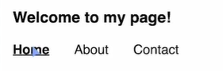

# React-Router

### Installation

```
npm install react-router-dom 
```

### Setup in React Project

- Wrap the App with browser Router has shown below.

```
ReactDOM.createRoot(document.getElementById("root")).render(
  <React.StrictMode>
    <BrowserRouter>
      <App />
    </BrowserRouter>
  </React.StrictMode>
);

```

- return like this App.js

```
return (
    <Routes>
      <Route path="/login" Component={LoginPage}></Route>
      <Route path="/" Component={Home}></Route>
    </Routes>
  );

```

### Difference between Element and Component

- Element

```
<Route path="/login" element={<LoginPage></LoginPage>}></Route>
```

- Component

```
<Route path="/" Component={Home}></Route>
 ```

### Conditional Rendering in same url

- Element to render JSX

```
<Route path="/login" element={loggedInStatus?<LoginPage></LoginPage>:"Hello"}></Route> 
```

- Component- Should only provide/render component neither JSX nor <></>

```
<Route path="/login" Component={loggedInStatus?LoginPage:Home}></Route>
```

### Redirection conditionally

```
function App() {
  return (
    <Routes>
      <Route path="/login" element={<LoginPage />} />
      <Route path="/" element={<PrivateRoute component={Home} />} />
    </Routes>
  );
}
```

#### PrivateRoute Implementation

```
const PrivateRoute = ({ component: Component, ...rest }) => {
  const [isAuthenticated, setIsAuthenticated] = useState(null);

  useEffect(() => {
    const fetchData = async () => {
      // Do some condition check
      setIsAuthenticated(.....);
    };

    fetchData();
  }, []);

  if (isAuthenticated === null) {
    // You can optionally render a loading spinner or message while waiting for authentication check
    return <div>Loading...</div>;
  }

  return isAuthenticated ? <Component {...rest} /> : <Navigate to="/login" />;
};

export default PrivateRoute;
```

### Link

- Similar To anchor Tag but it will not refresh the page
- Use this to navigate through URL without page Refresh.

```
<Link to="/home"> <li>Home</li> </Link> 
```

### Router Params

``` 
<Route path="/vans/:id/:type" element={<VansDetailedPage/>}></Route>
```
To Access the Id in the VanDetailedPage component:
``` 
import {useParams} from 'react-router-dom';

// inside component
const params= useParams();
console.log(params.id) /// will give you the id
console.log(params.type) /// will give you the type
```

### Nested Routes
- Nested Urls: 
     - /vans
     - /vans/types

- Shared Ui:
    - When you want to share the common Ui between the same routes.

#### Layout Route:

- Used in senarios where you want the certain component through out the Routes something like NavBar or Footer.

-  Create a NavBar.jsx file and have your NavBar code there and also create a Layout.jsx file.
- Wrap the all the Routes with Single Parent Route to create a parent child relationship.

``` 
<Route element={<Layout/>}>
<Route path="/" element={<Home/>}></Route>
<Route path="/vans" element={<Vans/>}></Route>
<Route path="/about" element={<About/>}></Route>
</Route>
```

#### Outlet:


- This will take the child route under the parent route and render on the screen when url matches.

``` 
import {Outlet} from 'react-router-dom'

export const Layout=()=>{
  return(
    <div>
      <NavBar/>
      <Outlet/>
    </div>
  )
}
```

#### Deep Nested Route:


- Something like above.

``` 
<Route element={<Layout/>}>
<Route path="/" element={<Home/>}></Route>
<Route path="/vans" element={<Vans/>}></Route>
<Route path="/about" element={<About/>}></Route>

<Route path="/host" element={<HostLayout/>}>

<Route path="/host" element={<Dashboard/>}></Route> (donot use this,use Index Route to Fix)
<Route path="/host/income" element={<Income/>}></Route>
<Route path="/reviews" element={<Reviews/>}></Route>

</Route>
</Route>
```

#### Relative Routes:

- You donot need actually need to have that / at each level of path.
- Here if you remove the / for the path it would look for the parent Route if it exist if not it would consider it as the root path.

``` 
<Route element={<Layout/>}>
        <Route path="/" element={<Home/>}></Route>
        <Route path="vans" element={<Vans/>}></Route>
        <Route path="about" element={<About/>}></Route>

        <Route path="host" element={<HostLayout/>}>
            <Route path="host" element={<Dashboard/>}></Route> (donot use this,use Index Route to Fix)
            <Route path="income" element={<Income/>}></Route>
            <Route path="reviews" element={<Reviews/>}></Route>
         </Route>
</Route>
```

#### Index:
- putting index will say that it should also be loaded with the root level path intial
``` 
<Route path="/" element={<Layout/>}>
      <Route index element={<Home/>}></Route>
      <Route path="vans" element={<Vans/>}></Route>
      <Route path="about" element={<About/>}></Route>

      <Route path="host" element={<HostLayout/>}>
              <Route index element={<Dashboard/>}></Route> 
              <Route path="income" element={<Income/>}></Route>
              <Route path="reviews" element={<Reviews/>}></Route>
      </Route>
</Route>
```

### NavLink

- Used for visual feedback the you opted for the path.
- Similar to Link but with extra features.




``` 
import {NavLink} from 'react-router-dom';

<NavLink to='/' className >Home</NavLink>
<NavLink to='/about'>About</NavLink>
<NavLink to='/contact'>Contact</NavLink>
```
